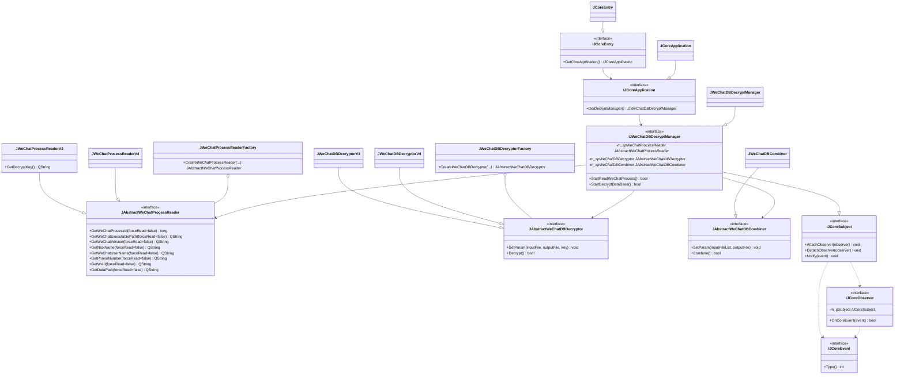
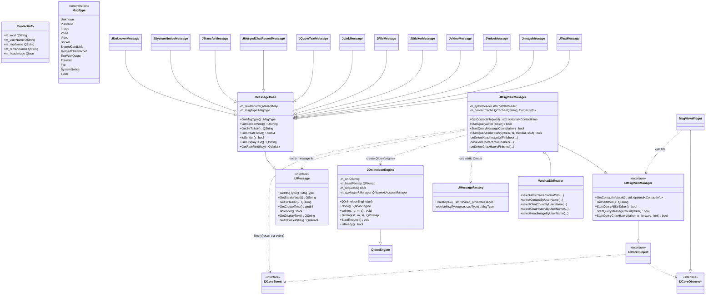

# WeChatMsgDump

一个面向 Windows 的微信消息导出与浏览工具：从已登录的微信进程读取关键信息，解密数据库，合并聊天库，并在本地界面中浏览会话与消息。

## 项目简介

`WeChatMsgDump` 是基于 C++20 + Qt6 的桌面程序，核心目标是把“微信本地数据库 -> 可读消息”这条链路工程化，包含：

- 读取微信进程信息（版本、路径、wxid、数据目录等）
- 按版本偏移提取解密所需信息
- 批量解密多库并合并输出
- 联系人、会话、历史消息的本地查询与展示

## 能做什么

- 自动识别当前机器上已登录微信进程
- 展示微信版本、用户标识、数据目录等信息
- 解密核心聊天数据库（含 `MSG*.db` / `MediaMSG*.db` / `MicroMsg.db` / OpenIM 相关库）
- 合并解密产物，生成统一可查询数据库
- 浏览会话列表、消息历史、头像及多种消息类型（文本、图片、语音、视频、文件、引用、转账、系统消息等）

## 微信版本支持范围

当前仓库实现以 **微信 3.x（V3 体系）** 为主，支持版本由 `source/msgcore/resource/configs/offsetv3.json` 决定。

- 偏移表最早版本：`3.2.1.154`
- 偏移表最新版本：`3.9.12.55`
- 已实现解密器与进程读取器：`v3`

说明：

- 代码中有 v4 预留设计（工厂/抽象层），但当前仓库资源与实现仍以 v3 为主。
- 超出偏移表范围的微信版本可能出现“无法读取密钥/解密失败”。

## 目录介绍

- `context/`：项目AI知识库（架构、流程、接口、构建、数据库模型）
- `design/`：架构设计图（PlantUML）
- `source/`：源码主目录
- `source/wechatmsgdump/`：程序入口（EXE）
- `source/msgui/`：UI 层（解密向导 + 消息浏览）
- `source/msgcore/`：核心层（进程读取、解密、合并、查询）
- `source/junuoui/`：通用 UI 组件库
- `source/junuobase/`：基础工具库
- `source/include/`：跨模块接口定义（如 `global_interface.h`）

## 架构设计

### 解密链路类图（来自  `design/decrypt_design.pu` ）



### 消息浏览类图（来自  `design/msgviewer_design.pu` ）



## 核心流程

1. `wechatmsgdump.exe` 启动并加载 `msgui.dll`
2. `msgui.dll` 动态加载 `msgcore.dll`，获取核心入口
3. UI 进入解密向导：读取进程信息 -> 选择进程 -> 开始解密
4. `msgcore` 并行解密多个数据库，完成后合并为统一库
5. UI 切换到消息浏览：查询会话、消息数、历史消息并渲染

## 如何编译

### 1) 环境要求

- Windows 10/11（项目主要面向 Windows）
- Visual Studio 2022（MSVC）
- CMake >= 3.16
- Python 3（用于构建脚本）
- vcpkg
- 作者是Qt6.5.3

### 2) vcpkg 安装依赖

在 `x64-windows` triplet 下安装：

```powershell
vcpkg install openssl:x64-windows protobuf:x64-windows
```

说明：

- `openssl` 供解密模块链接
- `protobuf` 用于 `.proto` 代码生成与链接

### 3) 配置与构建

在仓库根目录执行（推荐 out-of-source 构建）：

```powershell
mkdir build
cd build

# Debug
cmake ..\source ^
  -DCMAKE_BUILD_TYPE=Debug ^
  -DCMAKE_TOOLCHAIN_FILE=path/to/vcpkg/scripts/buildsystems/vcpkg.cmake ^
  -DVCPKG_TARGET_TRIPLET=x64-windows

cmake --build . --config Debug -j
```

Release（如需关闭优化便于调试）示例：

```powershell
cmake ..\source ^
  -DCMAKE_BUILD_TYPE=Release ^
  -DCMAKE_TOOLCHAIN_FILE=path/to/vcpkg/scripts/buildsystems/vcpkg.cmake ^
  -DVCPKG_TARGET_TRIPLET=x64-windows ^
  -DCMAKE_C_FLAGS_RELEASE="/Od" ^
  -DCMAKE_CXX_FLAGS_RELEASE="/Od"

cmake --build . --config Release -j
```

### 4) 产物位置

- 可执行文件：`build/output/bin/wechatmsgdump.exe`
- 动态库：`build/output/lib/`
- 翻译文件：`build/output/translation/`

## 数据输出与运行说明

- 合并数据库默认输出：`AppLocalDataLocation/<wxid>/merged_db.db`
- 解密临时目录：`AppLocalDataLocation/<wxid>/decrypted/`
- 建议在“微信已登录、数据库文件完整、无权限拦截”场景下执行解密

## 常见问题（FAQ）

### 1. 读取进程成功但解密失败

优先检查：

- 微信版本是否在 `offsetv3.json` 支持范围内
- 目标目录文件访问权限是否正常
- 是否被安全软件拦截文件读写

### 2. 能否支持更新版本微信

可以，通常需要：

- 补齐新版本偏移到 `offsetv3.json`（或引入 v4 配置与实现）
- 必要时扩展解密器/进程读取器工厂注册项

### 3. 为什么头像或部分内容会延迟显示

联系人与头像采用“缓存命中即时返回 + 异步回填通知”的策略，首次查询可能出现短暂占位。

## 合规与免责声明

- 本项目与腾讯/微信官方无关联。
- 请仅在合法合规、获得授权的前提下使用本项目。
- 严禁将本项目用于任何非法用途；使用者自行承担相关责任。
